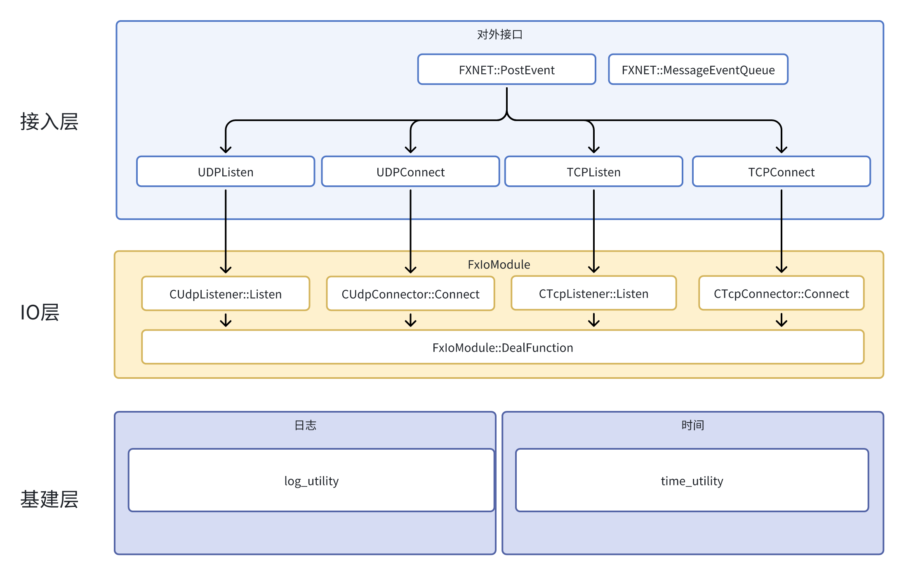

fxnet

=====================================================================
一个网络库的实现,包含TCP UDP.  
UDP实现了数据数据可靠性传输  
UDP可靠性传输实现文件为 buff_contral.h 是纯算法的实现
# 技术特性
以带宽浪费的代价换取了比TCP快的传输速度（包长不超过mtu的情况下 延迟为tcp的 65%-70%）
#
### 端口监听(非常重要)：
UDP监听方式如下
e.g. FXNET::PostEvent(new FXNET::UDPListen("192.168.10.103", 10085));
#
#### 测试方法
使用clumsy 模拟丢包（丢包率20%）  
BufferContral::m_dSendFrequency 会控制最高发送频率 内网测试需修改为接近0的值
以防止因为发送频率限制导致的延迟较高
#
#### 测试结果
正常无丢包情况下 tcp udp 延迟接近
丢包情况下 udp延迟为tcp 65%-70%
#
#### 编译环境
windows 使用nmake  
linux 使用gcc（4.8.5）  
#
#### 测试环境
udp使用绑定端口的方式实现有连接传输 因此 服务器 客户端 必须部署在不同机器上

#
#### 架构图

